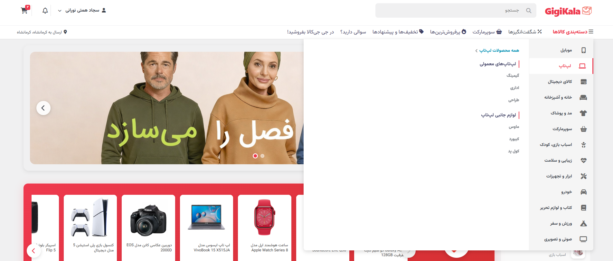
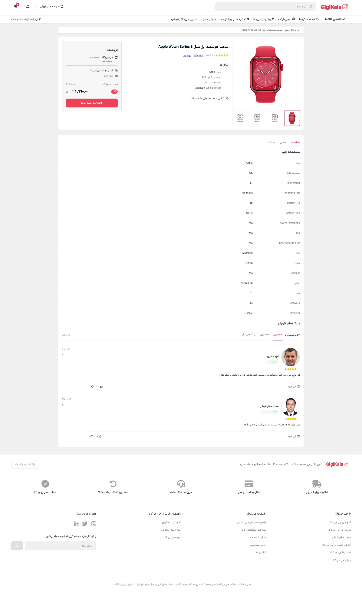
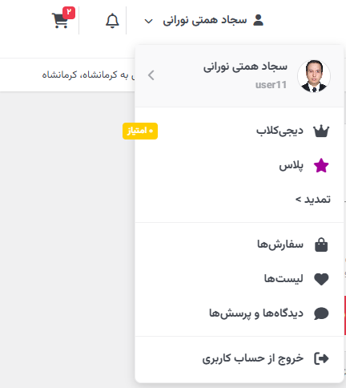
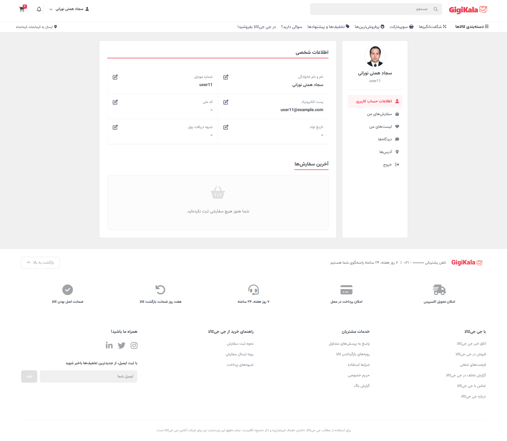
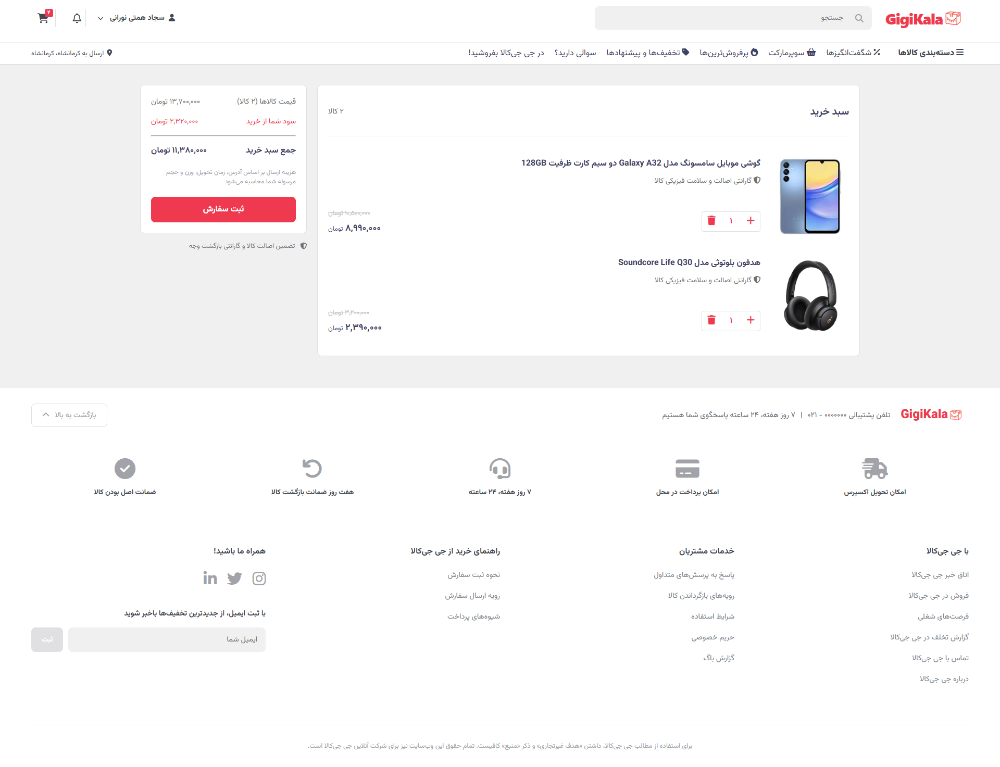

# 🛍️ GigiKala - Advanced Digikala Clone
دیجیکالا کلون


> An immersive, pixel-perfect clone of Iran's leading e-commerce platform, **Digikala**, built with **Vanilla JavaScript**, **CSS3**, and **HTML5**.

[](https://opensource.org/licenses/MIT)
[](https://fa.wikipedia.org/wiki/Persian_language)
[](https://files.design/rtl-styling)
[]()

## 📖 About The Project

**GigiKala** is a high-fidelity frontend simulation of a large-scale e-commerce application. It meticulously replicates the user interface and user experience of Digikala, featuring complex navigational structures, real-time search, interactive sliders, and a fully responsive design tailored for RTL (Right-to-Left) languages.

This project demonstrates advanced DOM manipulation, state management without frameworks, and complex CSS layouts (Grid/Flexbox) to handle extensive product data hierarchies.

## ✨ Key Features

### 🖥️ User Interface & Experience
*   **Authentic Design System**: Pixel-perfect implementation of Digikala's color palette (#ef394e), typography (Vazirmatn), and iconography.
*   **Responsive RTL Layout**: Fully optimized for Persian (Farsi) users with proper directionality and spacing.
*   **Dynamic Sliders**: Custom-built touch-friendly sliders for banners and "Amazing Offers" (Shageft-Angiz) with countdown timers.
*   **Glassmorphism Effects**: Modern UI touches with backdrop filters and smooth transitions.

### 🧭 Navigation & Discovery
*   **Deep Mega Menu**: A complex 5-level nested category system (Category → Sub → Micro → Nano → Pico) dynamic rendering.
*   **Intelligent Search**: Real-time AJAX-style search bar with instant results dropdown.
*   **Mobile-First Navigation**: Specialized mobile bottom navigation and a dedicated full-screen overlay for category exploration on small screens.

### 🛒 E-Commerce Functionality
*   **Shopping Cart System**: Functional cart with local storage persistence, item count updates, and dynamic price calculation.
*   **User Authentication Flow**: Login and Sign-up pages with validation logic.
*   **Product Details**: Rich product pages with gallery, specifications, user reviews, and rating systems.
*   **Checkout Process**: Step-by-step checkout interface.

## 🛠️ Technology Stack

| Core | Styling | Assets |
| :--- | :--- | :--- |
|  |  |  |
|  |  |  |

## 📸 Screenshots

<div align="center">
  <h3>🏠 Home Page</h3>
  <!-- Replace with actual screenshot: screenshots/home.png -->
  
  
  <h3>📱 Mobile View & Menu</h3>
  <div style="display: flex; justify-content: center; gap: 20px;">
    <!-- Replace with: screenshots/mobile-home.png -->
    
    <!-- Replace with: screenshots/mobile-menu.png -->
    
  </div>

  <h3>🛍️ Product Page</h3>
  <!-- Replace with: screenshots/product.png -->
  

  <h3>📂 Mega Menu</h3>
  <!-- Replace with: screenshots/megamenu.png -->
  

   <h3>👤 User Profile & Dashboard</h3>
  <!-- User Menu Dropdown -->
  <div style="text-align: center;">
    <h4>🔽 User Menu</h4>
    
    
    <p>Quick access to account settings, orders, and logout</p>
  </div>

  <h3>📦 Order Management</h3>
  
  
  
</div>

> **Note**: To see the latest visuals, please clone the repo and view it locally!

## 🚀 Getting Started

To run this project locally, you don't need any complex build tools.

1.  **Clone the repository**
    ```bash
    git clone https://github.com/sajadhn1988/Digikala.git
    ```

2.  **Navigate to the project directory**
    ```bash
    cd Digikala
    ```

3.  **Open in Browser**
    Simply double-click `index.html` or serve it using a local server (recommended for proper font and JSON loading):
    
    *Using VS Code Live Server:*
    - Install "Live Server" extension.
    - Right-click `index.html` and select "Open with Live Server".

    *Install Live Server Extension (if not already installed)*
    ```bash
    View Your Site
    Your default browser will open automatically
    ```
    Then visit `The site will be available at: http://127.0.0.1:5500/`


## 📂 Project Structure

```
Digikala/
├── index.html          # Main landing page
├── product.html        # Single product view
├── category.html       # Category listing view
├── checkout.html       # Shopping cart & checkout
├── login.html          # Authentication
├── public/
│   ├── css/            # Stylesheets (mobile.css, header.css, etc.)
│   ├── js/             # Logic (script.js, cart.js, etc.)
│   │   ├── categories/ # Huge dataset for 5-level categories
│   │   └── ...
│   ├── icons/          # SVG and PNG assets
│   └── images/         # Content images
└── uploads/            # Dynamic user uploads/product images
```

## 🤝 Contributing

Contributions are what make the open source community such an amazing place to learn, inspire, and create. Any contributions you make are **greatly appreciated**.

1.  Fork the Project
2.  Create your Feature Branch (`git checkout -b feature/AmazingFeature`)
3.  Commit your Changes (`git commit -m 'Add some AmazingFeature'`)
4.  Push to the Branch (`git push origin feature/AmazingFeature`)
5.  Open a Pull Request

## 👤 Author

**Sajad** - [GitHub Profile](https://github.com/sajadhn1988)

---

<div align="center">
  Made with ❤️ and plenty of ☕ by Sajjad Hemati Nourani  
</div>

<div align="center"> حمایت مالی
  https://donito.me/sajad-hemati-nourani
</div>
